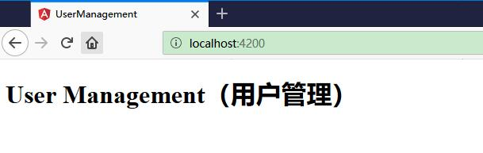
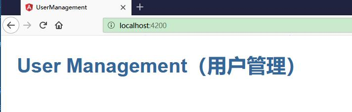

# 修改 AppComponent 组件

通过本节，你将学会了使用 Angular 组件来显示数据，并使用双花括号插值表达式显示了应用标题。

## 修改 app.component.ts

修改 src/app/app.component.ts 文件


将 title 修改如下：

```ts
title = 'User Management（用户管理）';
```

完整的 app.component.ts 代码如下：


```ts
import { Component } from '@angular/core';

@Component({
  selector: 'app-root',
  templateUrl: './app.component.html',
  styleUrls: ['./app.component.css']
})
export class AppComponent {
  title = 'User Management（用户管理）';
}
```

## 修改 app.component.html


打开组件的模板文件 src/app/app.component.html 并清空 Angular CLI 自动生成的默认模板。改为下列 HTML 内容：

```html
<h1>{{title}}</h1>
```

双花括号语法是 Angular 的插值绑定语法。 这个插值绑定的意思是把组件的 title 属性的值绑定到 HTML 中的 h1 标记中。

浏览器自动刷新，并且显示出了新的应用标题。




  


## 添加应用样式

大多数应用都会努力让整个应用保持一致的外观。 因此，CLI 会生成一个空白的 styles.css 文件。 你可以把全应用级别的样式放进去。

打开 src/styles.css 文件，编写如下内容。这些样式都是 Angular 团队推荐的默认样式。

```css
/* Application-wide Styles */
h1 {
  color: #369;
  font-family: Arial, Helvetica, sans-serif;
  font-size: 250%;
}
h2, h3 {
  color: #444;
  font-family: Arial, Helvetica, sans-serif;
  font-weight: lighter;
}
body {
  margin: 2em;
}
body, input[text], button {
  color: #888;
  font-family: Cambria, Georgia;
}
/* everywhere else */
* {
  font-family: Arial, Helvetica, sans-serif;
}
```

此时 app.component.html 便有了新样式，立马变得美观了许多：

