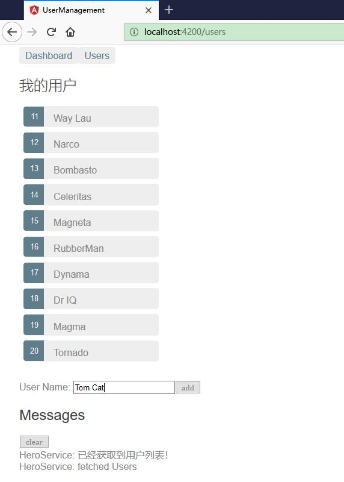
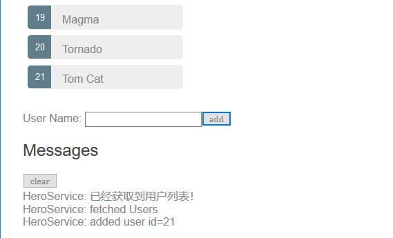
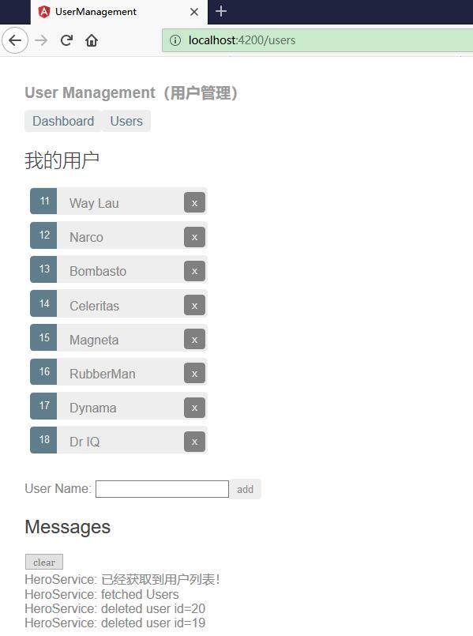
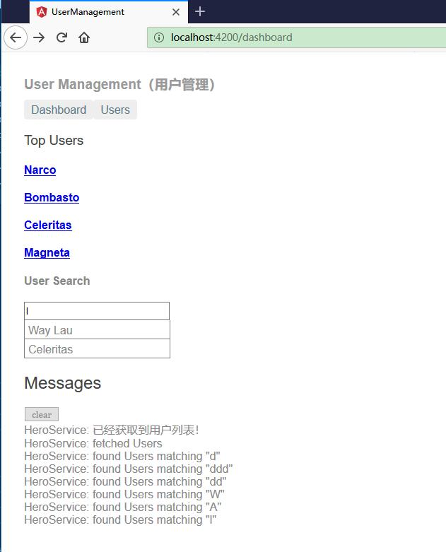

# 基于 HTTP 实现用户信息的 CURD

本章节，我们将基于 HTTP 实现用户信息的 CURD，即查询、修改、创建、删除用户。


## 修改用户

在用户详情视图中编辑用户的名字。 随着输入，用户的名字也跟着在页面顶部的标题区更新了。 但是当你点击“后退”按钮时，这些修改都丢失了。

如果你希望保留这些修改，就要把它们写回到服务器。

在用户详情模板（user-detail.component.html）的底部添加一个保存按钮，它绑定了一个 click 事件，事件绑定会调用组件中一个名叫 save() 的新方法：


```html
<button (click)="save()">save</button>
```

在 user-detail.component.t 中添加如下的 save() 方法，它使用用户服务中的 updateUser() 方法来保存对用户名字的修改，然后导航回前一个视图。


```ts
save(): void {
    this.userService.updateUser(this.user)
        .subscribe(() => this.goBack());
}
```


### 添加 UserService.updateUser()

updateUser() 的总体结构和 getusers() 很相似，但它会使用 http.put() 来把修改后的用户保存到服务器上。

```ts
updateUser (user: User): Observable<any> {
    return this.http.put(this.usersURL, user, this.httpOptions).pipe(
        tap(_ => this.log(`updated user id=${user.id}`)),
        catchError(this.handleError<any>('updateUser'))
    );
}
```

HttpClient.put() 方法接受三个参数

* URL 地址
* 要修改的数据（这里就是修改后的用户）
* 选项

URL 没变。用户 Web API 通过用户对象的 id 就可以知道要修改哪个用户。

用户 Web API 期待在保存时的请求中有一个特殊的头。 这个头是在 UserService 的 httpOptions 常量中定义的。

```ts
private httpOptions:Object = {
    headers: new HttpHeaders({ 'Content-Type': 'application/json' })
};
```

刷新浏览器，修改用户名，保存这些修改，然后点击“后退”按钮。 现在，改名后的用户已经显示在列表中了。


## 添加新用户

要添加用户，本应用中只需要用户的名字。你可以使用一个和添加按钮成对的 input 元素。

把下列代码插入到 UsersComponent 模板（src/app/users/users.component.html）中标题的紧后面：

```html
<div>
  <label>User Name:
    <input #userName />
  </label>
  <button (click)="add(userName.value); userName.value=''">
    add
  </button>
</div>
```

当点击事件触发时，调用组件的点击处理器，然后清空这个输入框，以便用来输入另一个名字。修改 src/app/users/users.component.ts 添加 add 方法：
```ts
add(name: string): void {
    name = name.trim();
    if (!name) { return; }
    this.userService.addUser({ name } as User)
        .subscribe(user => {
        this.users.push(user);
        });
}
```


当指定的名字非空时，这个处理器会用这个名字创建一个类似于 User 的对象（只缺少 id 属性），并把它传给服务的 addUser() 方法。

当 addUser 保存成功时，subscribe 的回调函数会收到这个新用户，并把它追加到 users 列表中以供显示。

此时，我们还需要创建 UserService.addUser() 方法。

### 添加 UserService.addUser()

往 UserService 类中添加 addUser() 方法。修改 src/app/User.service.ts 添加 addUser 方法：

```ts
addUser (user: User): Observable<User> {
    return this.http.post<User>(this.usersURL, user, this.httpOptions).pipe(
        tap((user: User) => this.log(`added user id=${user.id}`)),
        catchError(this.handleError<User>('addUser'))
    );
}
```

UserService.addUser() 和 updateUser 有两点不同。

它调用 HttpClient.post() 而不是 put()。

它期待服务器为这个新的用户生成一个 id，然后把它通过 Observable<User> 返回给调用者。

刷新浏览器，并添加一些用户。






## 删除用户

用户列表中的每个用户都有一个删除按钮。点击删除按钮，就能删除用户。

把下列按钮（button）元素添加到 UsersComponent 的模板中，就在每个 `<li>` 元素中的用户名字后方。

```ts
<button class="delete" title="delete user"
  (click)="delete(user)">x</button>
```

这样，完整的用户列表（src/app/users/users.component.html）的 HTML 应该是这样的：


```html
<h2>我的用户</h2>
<ul class="users">
    <li *ngFor="let user of users"> 
    <a routerLink="/detail/{{user.id}}">
      <span class="badge">{{user.id}}</span> {{user.name}}
    </a>
    <button class="delete" title="delete user"
  (click)="delete(user)">x</button>
  </li>
</ul>

<div>
  <label>User Name:
    <input #userName />
  </label>
  <button (click)="add(userName.value); userName.value=''">
    add
  </button>
</div>
```

要把删除按钮定位在每个用户条目的最右边，就要往 users.component.css 中添加一些 CSS:

```css
button {
  background-color: #eee;
  border: none;
  padding: 5px 10px;
  border-radius: 4px;
  cursor: pointer;
  cursor: hand;
  font-family: Arial;
}
 
button:hover {
  background-color: #cfd8dc;
}
 
button.delete {
  position: relative;
  left: 194px;
  top: -32px;
  background-color: gray !important;
  color: white;
}
```

在 src/app/users/users.component.ts 中添加 delete() 方法：

```ts
delete(user: User): void {
    this.users = this.users.filter(h => h !== user);
    this.userService.deleteUser(user).subscribe();
}
```

虽然这个组件把删除用户的逻辑委托给了 userService，但仍保留了更新它自己的用户列表的职责。组件的 delete() 方法会在 userService 对服务器的操作成功之前，会先从列表中移除要删除的用户。

组件与 userService.delete() 返回的 Observable 还完全没有关联，所以必须订阅它。


### 添加 UserService.deleteUser() 方法

把 deleteuser() 方法添加到 UserService （src/app/user.service.ts）中，代码如下。

```ts
deleteUser (user: User | number): Observable<User> {
    const id = typeof user === 'number' ? user : user.id;
    const url = `${this.usersURL}/${id}`;

    return this.http.delete<User>(url, this.httpOptions).pipe(
        tap(_ => this.log(`deleted user id=${id}`)),
        catchError(this.handleError<User>('deleteUser'))
    );
}
```

其中：

* 它调用了 HttpClient.delete。
* URL 就是用户的资源 URL 加上要删除的用户的 id。
* 你不用像 put 和 post 中那样需要发送数据。
* 你仍要发送 httpOptions。

刷新浏览器，并试一下这个新的删除功能。

效果如下：




## 根据名字搜索用户


你将往仪表盘中加入用户搜索特性。 当用户在搜索框中输入名字时，你会不断发送根据名字过滤用户的 HTTP 请求。 你的目标是仅仅发出尽可能少的必要请求。

### 添加 UserService.searchUsers

先把 searchUsers 方法添加到 UserService （src/app/user.service.ts）中。


```ts
searchUsers(term: string): Observable<User[]> {
    if (!term.trim()) {
        return of([]);
    }
    return this.http.get<User[]>(`${this.usersURL}/?name=${term}`).pipe(
        tap(_ => this.log(`found Users matching "${term}"`)),
        catchError(this.handleError<User[]>('searchUsers', []))
    );
}
```

如果没有搜索词，该方法立即返回一个空数组。 剩下的部分和 getUsers() 很像。 唯一的不同点是 URL，它包含了一个由搜索词组成的查询字符串。

### 为仪表盘添加搜索功能

打开 DashboardComponent 的模板并且把用于搜索用户的元素 `<app-user-search>` 添加到 DashboardComponent 模板（src/app/dashboard/dashboard.component.html）的底部。


```ts
<h3>Top Users</h3>
<div class="grid grid-pad">
  <a *ngFor="let user of users" class="col-1-4"
    routerLink="/detail/{{user.id}}">
    <div class="module user">
      <h4>{{user.name}}</h4>
    </div>
  </a>
</div>

<app-user-search></app-user-search>
```


但目前，UserSearchComponent 还不存在，因此，Angular 找不到哪个组件的选择器能匹配上 `<app-user-search>`。


### 创建 UserSearchComponent

使用 CLI 创建一个 UserSearchComponent。

```ts
ng generate component user-search
```

CLI 生成了 UserSearchComponent 相关的几个文件，并把该组件添加到了 AppModule 的声明中。以下是控制台输出：

```ts
ng generate component user-search

CREATE src/app/user-search/user-search.component.html (30 bytes)
CREATE src/app/user-search/user-search.component.spec.ts (657 bytes)
CREATE src/app/user-search/user-search.component.ts (288 bytes)
CREATE src/app/user-search/user-search.component.css (0 bytes)
UPDATE src/app/app.module.ts (1283 bytes)
```

把生成的 UserSearchComponent 的模板（src/app/user-search/user-search.component.html ），改成一个输入框和一个匹配到的搜索结果的列表。代码如下：


```ts
<div id="search-component">
  <h4>User Search</h4>
 
  <input #searchBox id="search-box" (keyup)="search(searchBox.value)" />
 
  <ul class="search-result">
    <li *ngFor="let user of users$ | async" >
      <a routerLink="/detail/{{user.id}}">
        {{user.name}}
      </a>
    </li>
  </ul>
</div>
```

修改 User-search.component.css ，添加相关的样式：

```css
.search-result li {
  border-bottom: 1px solid gray;
  border-left: 1px solid gray;
  border-right: 1px solid gray;
  width:195px;
  height: 16px;
  padding: 5px;
  background-color: white;
  cursor: pointer;
  list-style-type: none;
}
 
.search-result li:hover {
  background-color: #607D8B;
}
 
.search-result li a {
  color: #888;
  display: block;
  text-decoration: none;
}
 
.search-result li a:hover {
  color: white;
}
.search-result li a:active {
  color: white;
}
#search-box {
  width: 200px;
  height: 20px;
}
 
 
ul.search-result {
  margin-top: 0;
  padding-left: 0;
}
```

当用户在搜索框中输入时，一个 keyup 事件绑定会调用该组件的 search() 方法，并传入新的搜索框的值。

### AsyncPipe

观察：

```ts
<li *ngFor="let user of users$ | async" >
```


如你所愿，`*ngFor` 遍历渲染出了这些用户。

仔细看，你会发现`*ngFor`  是在一个名叫 `users$` 的列表上迭代，而不是 users。


`$`是一个命名惯例，用来表明 `users$` 是一个 Observable，而不是数组。

`*ngFor` 不能直接使用 Observable。 不过，它后面还有一个管道字符（|），后面紧跟着一个 async，它表示 Angular 的 AsyncPipe。

AsyncPipe 会自动订阅到 Observable，这样你就不用再在组件类中订阅了。

### 修正 UserSearchComponent 类

修改所生成的 UserSearchComponent 类及其元数据（src/app/user-search/user-search.component.ts ），代码如下：


```ts
import { Component, OnInit } from '@angular/core';
import { Observable, Subject } from 'rxjs';
 
import {
   debounceTime, distinctUntilChanged, switchMap
 } from 'rxjs/operators';
 
import { User } from '../user';
import { UserService } from '../user.service';
 
@Component({
  selector: 'app-user-search',
  templateUrl: './user-search.component.html',
  styleUrls: ['./user-search.component.css']
})
export class UserSearchComponent implements OnInit {

  users$: Observable<User[]>;
  private searchTerms = new Subject<string>();
 
  constructor(private userService: UserService) {}

  search(term: string): void {
    this.searchTerms.next(term);
  }
 
  ngOnInit(): void {
    this.users$ = this.searchTerms.pipe(
      // 等待 300ms
      debounceTime(300),
 
      // 忽略与前一次搜索内容相同的数据
      distinctUntilChanged(),
 
      // 当搜索的内容变更时，切换到新的搜索Observable
      switchMap((term: string) => this.userService.searchUsers(term)),
    );
  }

}
```

其中，

* users$ 声明为一个 Observable;
* searchTerms 属性声明成了 RxJS 的 Subject 类型。
Subject 既是可观察对象的数据源，本身也是 Observable。 你可以像订阅任何 Observable 一样订阅 Subject。
你还可以通过调用它的 next(value) 方法往 Observable 中推送一些值，就像 search() 方法中一样。
* search() 是通过对文本框的 keystroke 事件的事件绑定来调用的。
每当用户在文本框中输入时，这个事件绑定就会使用文本框的值（搜索词）调用 search() 函数。 searchTerms 变成了一个能发出搜索词的稳定的流。

### 串联 RxJS 操作符

如果每当用户击键后就直接调用 searchUseres() 将导致创建海量的 HTTP 请求，浪费服务器资源并消耗大量网络流量。

应该怎么做呢？ngOnInit() 往 searchTerms 这个可观察对象的处理管道中加入了一系列 RxJS 操作符，用以缩减对 searchUsers() 的调用次数，并最终返回一个可及时给出用户搜索结果的可观察对象（每次都是 User[] ）。详细观察如下代码：

```ts
this.users$ = this.searchTerms.pipe(
    // 等待 300ms
    debounceTime(300),

    // 忽略与前一次搜索内容相同的数据
    distinctUntilChanged(),

    // 当搜索的内容变更时，切换到新的搜索Observable
    switchMap((term: string) => this.userService.searchUsers(term)),
);
```

在这段代码中，

* 在传出最终字符串之前，debounceTime(300) 将会等待，直到新增字符串的事件暂停了 300 毫秒。 这样你实际发起请求的间隔永远不会小于 300ms，减少了请求次数。
* distinctUntilChanged() 会确保只在过滤条件变化时才发送请求。
* switchMap() 会为每个从 debounce 和 distinctUntilChanged 中通过的搜索词调用搜索服务。 它会取消并丢弃以前的搜索可观察对象，只保留最近的。
* 借助 switchMap 操作符， 每个有效的击键事件都会触发一次 HttpClient.get() 方法调用。 即使在每个请求之间都有至少 300ms 的间隔，仍然可能会同时存在多个尚未返回的 HTTP 请求。
* switchMap() 会记住原始的请求顺序，只会返回最近一次 HTTP 方法调用的结果。 以前的那些请求都会被取消和舍弃。
* 注意，取消前一个 searchUseres() 可观察对象并不会中止尚未完成的 HTTP 请求。 那些不想要的结果只会在它们抵达应用代码之前被舍弃。

### 运行

再次运行本应用。在这个仪表盘中，在搜索框中输入一些文字，比如本例中的“l”。如果你输入的字符匹配上了任何现有用户的名字，你将会看到如下效果：


