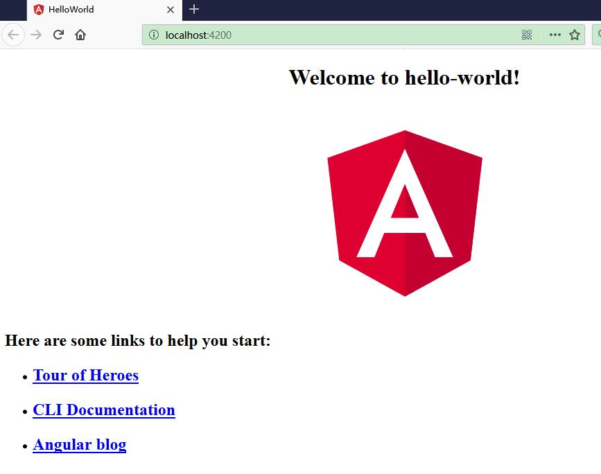

# 快速开启第一个 Angular 应用

本文带你快速开启第一个 Angular 应用“Hello World”。


## 新建应用


打开终端窗口。运行下列命令来生成一个新项目以及默认的应用代码：

```c
ng new hello-world
```


其中`hello-world`是指定的应用的名词。


详细过程如下：

```
D:\workspaceGithub\angular-tutorial\samples>ng new hello-world
CREATE hello-world/angular.json (3593 bytes)
CREATE hello-world/package.json (1316 bytes)
CREATE hello-world/README.md (1027 bytes)
CREATE hello-world/tsconfig.json (408 bytes)
CREATE hello-world/tslint.json (2805 bytes)
CREATE hello-world/.editorconfig (245 bytes)
CREATE hello-world/.gitignore (503 bytes)
CREATE hello-world/src/favicon.ico (5430 bytes)
CREATE hello-world/src/index.html (297 bytes)
CREATE hello-world/src/main.ts (370 bytes)
CREATE hello-world/src/polyfills.ts (3194 bytes)
CREATE hello-world/src/test.ts (642 bytes)
CREATE hello-world/src/styles.css (80 bytes)
CREATE hello-world/src/browserslist (375 bytes)
CREATE hello-world/src/karma.conf.js (964 bytes)
CREATE hello-world/src/tsconfig.app.json (170 bytes)
CREATE hello-world/src/tsconfig.spec.json (256 bytes)
CREATE hello-world/src/tslint.json (314 bytes)
CREATE hello-world/src/assets/.gitkeep (0 bytes)
CREATE hello-world/src/environments/environment.prod.ts (51 bytes)
CREATE hello-world/src/environments/environment.ts (631 bytes)
CREATE hello-world/src/app/app.module.ts (314 bytes)
CREATE hello-world/src/app/app.component.html (1141 bytes)
CREATE hello-world/src/app/app.component.spec.ts (1010 bytes)
CREATE hello-world/src/app/app.component.ts (215 bytes)
CREATE hello-world/src/app/app.component.css (0 bytes)
CREATE hello-world/e2e/protractor.conf.js (752 bytes)
CREATE hello-world/e2e/tsconfig.e2e.json (213 bytes)
CREATE hello-world/e2e/src/app.e2e-spec.ts (307 bytes)
CREATE hello-world/e2e/src/app.po.ts (208 bytes)
npm WARN deprecated istanbul-lib-hook@1.2.1: 1.2.0 should have been a major version bump
npm WARN tar ENOENT: no such file or directory, open 'D:\workspaceGithub\angular-tutorial\samples\hello-world\node_modules\.staging\fsevents-bd96250a\node_modules\needle\lib\auth.js'
...
```


## 启动应用

执行以下命令，来启动应用。

```
cd hello-world
ng serve --open
```

其中，

* ng serve 命令会启动开发服务器，监听文件变化，并在修改这些文件时重新构建此应用。
* 使用 --open（或 -o）参数可以自动打开浏览器并访问 http://localhost:4200/。


效果如下：

