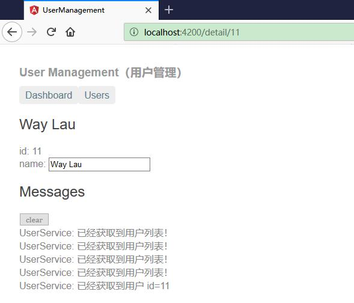
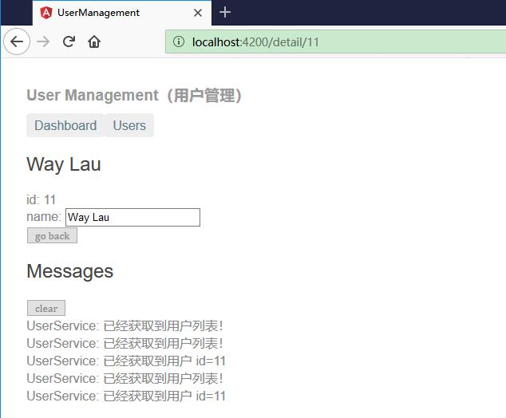

# 导航到用户详情

UserDetailComponent 用于显示所选用户的详情。但目前的 UserDetailsComponent 只能在 UsersComponent 的底部看到。

在本章节我们要实现能通过三种途径看到这些详情。

* 通过在仪表盘中点击某个用户。
* 通过在用户列表中点击某个用户。
* 通过把一个“深链接” URL 粘贴到浏览器的地址栏中来指定要显示的用户。


## 从 UsersComponent 中删除用户详情


当用户在 UsersComponent 中点击某个用户条目时，应用应该能导航到 UserDetailComponent，从用户列表视图切换到用户详情视图。 用户列表视图将不再显示，而用户详情视图要显示出来。


打开 UsersComponent 的模板文件（users/users.component.html），并从底部删除 `<app-user-detail>` 元素。

## 添加用户详情到路由

要导航到 id 为 11 的用户的详情视图，类似于 ~/detail/11 的 URL 将是一个不错的 URL。

打开 AppRoutingModule（src/app/app-routing.module.ts） 并导入 UserDetailComponent

```ts
import { UserDetailComponent }  from './user-detail/user-detail.component';
```

然后把一个参数化路由添加到 AppRoutingModule.routes 数组中，它要匹配指向用户详情视图的路径。

```ts
  { path: 'detail/:id', component: UserDetailComponent },
```

path 中的冒号（:）表示 :id 是一个占位符，它表示某个特定用户的 id。

此刻，应用中的所有路由都就绪了。

完整代码如下：

```ts
import { NgModule } from '@angular/core';
import { RouterModule, Routes } from '@angular/router';

import { DashboardComponent }   from './dashboard/dashboard.component';
import { UserDetailComponent }  from './user-detail/user-detail.component';
import { UsersComponent } from './users/users.component';

const routes: Routes = [
  { path: '', redirectTo: '/dashboard', pathMatch: 'full' },
  { path: 'dashboard', component: DashboardComponent },
  { path: 'detail/:id', component: UserDetailComponent },
  { path: 'users', component: UsersComponent }
];

@NgModule({
  imports: [ RouterModule.forRoot(routes) ],
  exports: [RouterModule]
})
export class AppRoutingModule { }
```


## 添加用户详情到 DashboardComponent


路由器已经有一个指向 UserDetailComponent 的路由了， 修改仪表盘中的用户连接，让它们通过参数化的用户详情路由进行导航。

```ts
<a *ngFor="let user of users" class="col-1-4"
    routerLink="/detail/{{user.id}}">
```

你正在 `*ngFor` 复写器中使用 Angular 的插值表达式来把当前迭代的 user.id 插入到每个 routerLink 中。


## UsersComponent 中的用户链接


UsersComponent 中的这些用户条目都是 <li> 元素，它们的点击事件都绑定到了组件的 onSelect() 方法中。现在需要修改如下：


```html
<h2>我的用户</h2>
<ul class="users">
    <li *ngFor="let user of users"> 
    <a routerLink="/detail/{{user.id}}">
      <span class="badge">{{user.id}}</span> {{user.name}}
    </a>
  </li>
</ul>
```

你还要修改私有样式表（users.component.css），让列表恢复到以前的外观。修改后的样式代码如下：

```css
/* UsersComponent's private CSS styles */
.users {
  margin: 0 0 2em 0;
  list-style-type: none;
  padding: 0;
  width: 15em;
}
.users li {
  position: relative;
  cursor: pointer;
  background-color: #EEE;
  margin: .5em;
  padding: .3em 0;
  height: 1.6em;
  border-radius: 4px;
}
 
.users li:hover {
  color: #607D8B;
  background-color: #DDD;
  left: .1em;
}
 
.users a {
  color: #888;
  text-decoration: none;
  position: relative;
  display: block;
  width: 250px;
}
 
.users a:hover {
  color:#607D8B;
}
 
.users .badge {
  display: inline-block;
  font-size: small;
  color: white;
  padding: 0.8em 0.7em 0 0.7em;
  background-color: #607D8B;
  line-height: 1em;
  position: relative;
  left: -1px;
  top: -4px;
  height: 1.8em;
  min-width: 16px;
  text-align: right;
  margin-right: .8em;
  border-radius: 4px 0 0 4px;
}
```


## 移除冗余代码

虽然 UsersComponent 类仍然能正常工作，但 onSelect() 方法和 selectedUser 属性已经没用了。

最好清理掉它们，将来你会体会到这么做的好处。 下面是删除了冗余代码之后的类（users.component.ts）：

```ts
import { Component, OnInit } from '@angular/core';

import { User } from '../user';
import { UserService } from '../user.service';

@Component({
  selector: 'app-users',
  templateUrl: './users.component.html',
  styleUrls: ['./users.component.css']
})
export class UsersComponent implements OnInit {

  users: User[];

  constructor(private userService: UserService) { }

  ngOnInit() {
    this.getUsers();
  }

  getUsers(): void {
    this.userService.getUsers()
        .subscribe(users => this.users = users);
  }
}
```


## 支持路由的 UserDetailComponent

以前，父组件 UsersComponent 会设置 UserDetailComponent.user 属性，然后 UserDetailComponent 就会显示这个用户。

现在，UsersComponent 已经不会再那么做了。 现在，当路由器会在响应形如 ~/detail/11 的 URL 时创建 UserDetailComponent。

UserDetailComponent 需要从一种新的途径获取要显示的用户。

* 获取创建本组件的路由，
* 从这个路由中提取出 id
* 通过 UserService 从服务器上获取具有这个 id 的用户数据。

在 UserDetailComponent  中先添加下列导入语句：

```ts
import { ActivatedRoute } from '@angular/router';
import { Location } from '@angular/common';

import { UserService }  from '../user.service'; 
```


然后把 ActivatedRoute、UserService 和 Location 服务注入到构造函数中，将它们的值保存到私有变量里：

```ts
constructor(
  private route: ActivatedRoute,
  private userService: UserService,
  private location: Location
) {}
```


* ActivatedRoute 保存着到这个 UserDetailComponent 实例的路由信息。 这个组件对从 URL 中提取的路由参数感兴趣。 其中的 id 参数就是要现实的用户的 id。
* UserService 从远端服务器获取用户数据，本组件将使用它来获取要显示的用户。
* location 是一个 Angular 的服务，用来与浏览器打交道。 稍后，你就会使用它来导航回上一个视图。


### 从路由参数中提取 id

修改  user.service.ts 文件，在 ngOnInit() 生命周期钩子 中调用 getUsers()，代码如下：

```ts
ngOnInit(): void {
this.getUser();
}

getUser(): void {
const id = +this.route.snapshot.paramMap.get('id');
this.userService.getUser(id)
    .subscribe(user => this.user = user);
}
```

route.snapshot 是一个路由信息的静态快照，抓取自组件刚刚创建完毕之后。

paramMap 是一个从 URL 中提取的路由参数值的字典。 "id" 对应的值就是要获取的用户的 id。

路由参数总会是字符串。 JavaScript 的 (+) 操作符会把字符串转换成数字，用户的 id 就是数字类型。

刷新浏览器，应用挂了。出现一个编译错误，因为 UserService 没有一个名叫 getUser() 的方法。下面就添加它。

### 添加 UserService.getUser() 方法


在 UserService 中并添加如下的 getUser() 方法

```ts
getUser(id: number): Observable<User> {
    this.messageService.add(`UserService: 已经获取到用户 id=${id}`);
    return of(USERS.find(user => user.id === id));
}
```

注意，反引号 ( ` ) 用于定义 JavaScript 的 模板字符串字面量，以便嵌入 id。

像 getUsers() 一样，getUser() 也有一个异步函数签名。 它用 RxJS 的 of() 函数返回一个 Observable 形式的模拟用户数据。

你将来可以用一个真实的 Http 请求来重现实现 getUser()，而不用修改调用了它的 UserDetailComponent。

### 运行

刷新浏览器，应用又恢复正常了。 你可以在仪表盘或用户列表中点击一个用户来导航到该用户的详情视图。

如果你在浏览器的地址栏中粘贴了 localhost:4200/detail/11，路由器也会导航到 id: 11 的用户（"Way Lau"）的详情视图。


\


## 添加返回按钮


通过点击浏览器的后退按钮，你可以回到用户列表或仪表盘视图，这取决于你从哪里进入的详情视图。

现在我要在在 UserDetail 视图中也添加这样的一个按钮。我们把该后退按钮添加到组件模板的底部，并且把它绑定到组件的 goBack() 方法。

修改 user-detail.component.html 添加：

```html
<button (click)="goBack()">go back</button>
```

在组件类中添加一个 goBack() 方法，利用你以前注入的 Location 服务在浏览器的历史栈中后退一步。

修改 user-detail.component.ts 添加：

```ts
goBack(): void {
  this.location.back();
}
```

刷新浏览器，并开始点击。 用户能在应用中导航：从仪表盘到用户详情再回来，从用户列表到用户详情，再回到用户列表。

你已经满足了在本章开头设定的所有导航需求。


\
