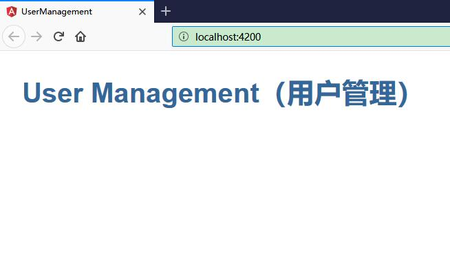

# 添加路由器

本章节，我们将实现路由功能。实现，不同的 URL 能够映射到不同的模块。

## 添加 AppRoutingModule

Angular 的最佳实践之一就是在一个独立的顶级模块中加载和配置路由器，它专注于路由功能，然后由根模块 AppModule 导入它。

按照惯例，这个模块类的名字叫做 AppRoutingModule，并且位于 src/app 下的 app-routing.module.ts 文件中。

使用 CLI 生成它。

```ts
ng generate module app-routing --flat --module=app
```

* --flat 把这个文件放进了 src/app 中，而不是单独的目录中。
* --module=app 告诉 CLI 把它注册到 AppModule 的 imports 数组中。

在控制台，可以看到如下生成的文件：

```ts
ng generate module app-routing --flat --module=app

CREATE src/app/app-routing.module.spec.ts (308 bytes)
CREATE src/app/app-routing.module.ts (194 bytes)
UPDATE src/app/app.module.ts (751 bytes)
```


其中，src/app/app-routing.module.ts 文件是这样的：


```ts
import { NgModule } from '@angular/core';
import { CommonModule } from '@angular/common';

@NgModule({
  imports: [
    CommonModule
  ],
  declarations: []
})
export class AppRoutingModule { }
```


通常我们不会在路由模块中声明组件，所以可以删除 @NgModule.declarations 并删除对 CommonModule 的引用。

你将会使用 RouterModule 中的 Routes 类来配置路由器，所以还要从 @angular/router 库中导入这两个符号。

添加一个 @NgModule.exports 数组，其中放上 RouterModule。导出 RouterModule 让路由器的相关指令可以在 AppModule 中的组件中使用。

此刻的 AppRoutingModule 是这样的：

```ts
import { NgModule } from '@angular/core';
import { RouterModule, Routes } from '@angular/router';

@NgModule({
  exports: [RouterModule]
})
export class AppRoutingModule { }
```

## 添加路由定义

路由定义会告诉路由器，当用户点击某个链接或者在浏览器地址栏中输入某个 URL 时，要显示哪个视图。

典型的 Angular 路由（Route）有两个属性：

* path：一个用于匹配浏览器地址栏中 URL 的字符串。
* component：当导航到此路由时，路由器应该创建哪个组件。

如果你希望当 URL 为 localhost:4200/users 时，就导航到 UsersComponent。

首先要导入 UsersComponent，以便能在 Route 中能引用它。 然后定义一个路由数组，其中的某个路由是指向这个组件的。

```ts
import { UsersComponent } from './users/users.component'

const routes: Routes = [
  { path: 'users', component: UsersComponent }
];
```

完成这些设置之后，路由器将会把 URL 匹配到 path: 'users'，并显示 UsersComponent。


## RouterModule.forRoot()

你必须首先初始化路由器，并让它开始监听浏览器中的地址变化。

把 RouterModule 添加到 @NgModule.imports 数组中，并用 routes 来配置它。你只要调用 imports 数组中的 RouterModule.forRoot() 函数就行了。

```ts
imports: [ RouterModule.forRoot(routes) ],
```

这个方法之所以叫 forRoot()，是因为你要在应用的顶级配置这个路由器。 forRoot() 方法会提供路由所需的服务提供商和指令，还会基于浏览器的当前 URL 执行首次导航。


所以，此刻的 AppRoutingModule 的代码如下：

```ts
import { NgModule } from '@angular/core';
import { RouterModule, Routes } from '@angular/router';

import { UsersComponent } from './users/users.component'

const routes: Routes = [
  { path: 'users', component: UsersComponent }
];

@NgModule({
  imports: [ RouterModule.forRoot(routes) ],
  exports: [RouterModule]
})
export class AppRoutingModule { }
```


## 添加路由出口 （RouterOutlet）

打开 AppComponent 的模板（app.component.html），把 <app-users> 元素替换为 <router-outlet> 元素。

```html
<h1>{{title}}</h1>
<router-outlet></router-outlet>
<app-messages></app-messages>
```

之所以移除 <app-users>，是因为只有当用户导航到这里时，才需要显示 UsersComponent。

<router-outlet> 会告诉路由器要在哪里显示路由到的视图。

能在 AppComponent 中使用 RouterOutlet，是因为 AppModule 导入了 AppRoutingModule，而 AppRoutingModule 中导出了 RouterModule。


## 运行查看效果


执行 `ng serve` 命名以启动应用。访问<http://localhost:4200/> 效果如下：




显示着应用的标题，但是没有显示用户列表。

在浏览器的地址栏，我们把 URL 改为<http://localhost:4200/users>时，由于路由到了 UsersComponent 模块，因此能够熟悉的主从结构的用户显示界面：

