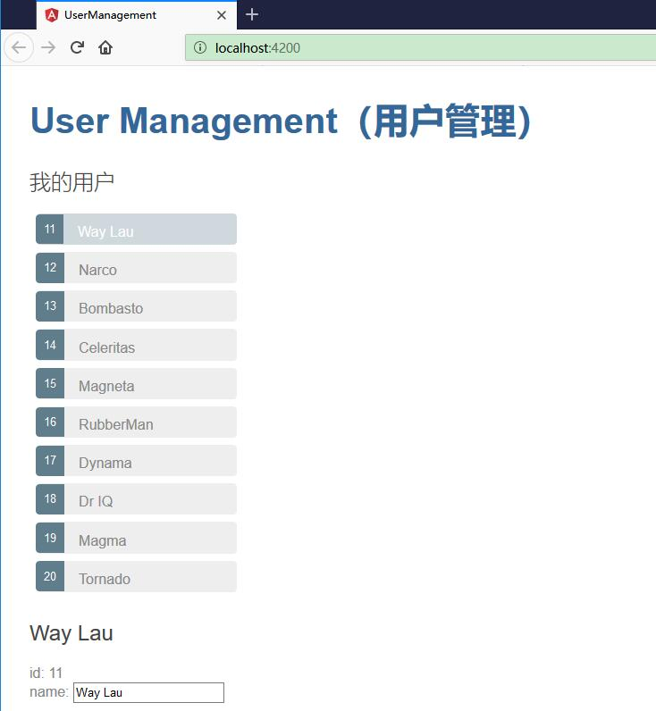

# 多组件化开发


本节，要把原来的 UsersComponent 重构成为 UsersComponent、UserDetailComponent 两个组件。多组件开发的方式具有以下优势：

* 通过缩减 UsersComponent 的职责简化了该组件。
* 可以把 UserDetailComponent 改进成一个功能丰富的用户编辑器，而不用改动父组件 UsersComponent。
* 可以改进 UsersComponent，而不用改动用户详情视图。
* 可以在其它组件的模板中重复使用 UserDetailComponent。

## 创建 UserDetailComponent 组件


与 UsersComponent 的创建方式类似，我们使用 Angular CLI 创建一个名为 user-detail 的新组件。

```ts
ng generate component user-detail
```


CLI 创建了一个新的文件夹 src/app/user-detail/，并生成了 UserDetailComponent 的相关的四个文件。

```ts
ng generate component user-detail
CREATE src/app/user-detail/user-detail.component.html (30 bytes)
CREATE src/app/user-detail/user-detail.component.spec.ts (657 bytes)
CREATE src/app/user-detail/user-detail.component.ts (288 bytes)
CREATE src/app/user-detail/user-detail.component.css (0 bytes)
UPDATE src/app/app.module.ts (556 bytes)
```


## 编辑 user-detail.component.html

从 UsersComponent 模板的底部把表示用户详情的 HTML 代码剪切粘贴到所生成的 UserDetailComponent 模板中。

所粘贴的 HTML 引用了 selectedUser。 新的 UserDetailComponent 可以展示任意用户，而不仅仅所选的。因此还要把模板中的所有 selectedUser 替换为 user。

完工之后，UserDetailComponent 的模板应该是这样的：


```html
<div *ngIf="user">
  <h2>{{user.name}}</h2>
  <div><span>id: </span>{{user.id}}</div>
  <div>
  <label>name:
      <input [(ngModel)]="user.name" placeholder="name">
  </label>
  </div>
</div>
```

## 编辑 user-detail.component.ts

UserDetailComponent 模板中绑定了组件中的 user 属性，它的类型是 User

打开 UserDetailComponent 类文件 user-detail.component.ts ，并导入 User 符号。


```ts
import { User } from '../user';
```

user 属性必须是一个带有 `@Input()` 装饰器的输入属性，因为外部的 UsersComponent 组件将会绑定到它。就像这样：

```html
<app-user-detail [user]="selectedUser"></app-user-detail>
```

修改 @angular/core 的导入语句，导入 Input 符号。


```ts
import { Component, OnInit, Input } from '@angular/core';
```

添加一个带有 @Input() 装饰器的 user 属性。

```ts
@Input() user: User;
```


完整代码如下：

```ts
import { Component, OnInit, Input } from '@angular/core';

import { User } from '../user';

@Component({
  selector: 'app-user-detail',
  templateUrl: './user-detail.component.html',
  styleUrls: ['./user-detail.component.css']
})
export class UserDetailComponent implements OnInit {

  @Input() user: User;

  constructor() { }

  ngOnInit() {
  }

}
```


## 编辑 users.component.html


UserDetailComponent 的选择器是 'app-user-detail'。 把 `<app-user-detail>` 添加到 UsersComponent 模板 users.component.html 的底部，以便把用户详情的视图显示到那里。

把 UsersComponent.selectedUser 绑定到该元素的 user 属性，就像这样：

```html
<app-user-detail [user]="selectedUser"></app-user-detail>
```

其中，`[user]="selectedUser"` 是 Angular 的属性绑定语法。


这是一种单向数据绑定。从 UsersComponent 的 selectedUser 属性绑定到目标元素的 user 属性，并映射到了 UserDetailComponent 的 user 属性。

现在，当用户在列表中点击某个用户时，selectedUser 就改变了。 当 selectedUser 改变时，属性绑定会修改 UserDetailComponent 的 user属性，UserDetailComponent 就会显示这个新的用户信息。

修改后的 UsersComponent 的模板 users.component.html 是这样的：

```html
<h2>我的用户</h2>
<ul class="users">
    <li *ngFor="let user of users" 
    [class.selected]="user === selectedUser"
    (click)="onSelect(user)">
    <span class="badge">{{user.id}}</span> {{user.name}}
  </li>
</ul>

<app-user-detail [user]="selectedUser"></app-user-detail>
```


## 运行


执行 `ng serve` 命令以启动应用。效果如下：

