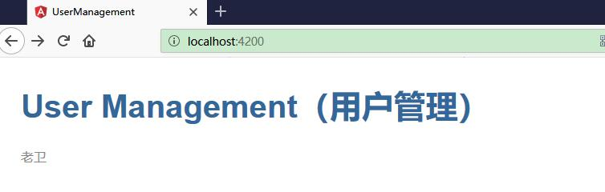
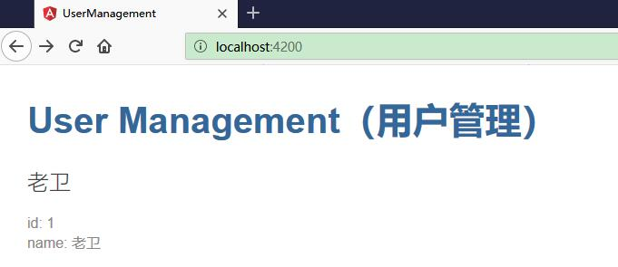
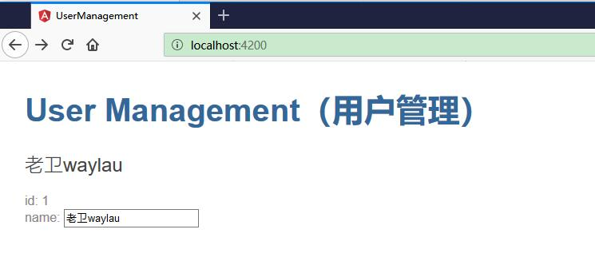

# 用户编辑器

用户编辑器用于将用户资料录入到用户管理系统中。

接下来我们要创建一个新的组件来显示用户信息并且把这个组件放到应用程序的外壳里去。

## 创建用户列表组件


使用 Angular CLI 创建一个名为 users 的新组件。

```ts
ng generate component users
```


CLI 创建了一个新的文件夹 src/app/users/，并生成了 UsersComponent 的相关的四个文件。

```ts
ng generate component users
CREATE src/app/users/users.component.html (24 bytes)
CREATE src/app/users/users.component.spec.ts (621 bytes)
CREATE src/app/users/users.component.ts (265 bytes)
CREATE src/app/users/users.component.css (0 bytes)
UPDATE src/app/app.module.ts (392 bytes)
```

UsersComponent 的类文件为 users.component.ts：

```ts
import { Component, OnInit } from '@angular/core';

@Component({
  selector: 'app-users',
  templateUrl: './users.component.html',
  styleUrls: ['./users.component.css']
})
export class UsersComponent implements OnInit {

  constructor() { }

  ngOnInit() {
  }

}
```


你要从 Angular 核心库中导入 Component 符号，并为组件类加上 @Component 装饰器。

@Component 是个装饰器函数，用于为该组件指定 Angular 所需的元数据。CLI 会自动生成了三个元数据属性：

* selector— 组件的选择器（CSS 元素选择器）
* templateUrl— 组件模板文件的位置。
* styleUrls— 组件私有 CSS 样式表文件的位置。

CSS 元素选择器 app-users 用来在父组件的模板中匹配 HTML 元素的名称，以识别出该组件。

ngOnInit 是一个生命周期钩子，Angular 在创建完组件后很快就会调用 ngOnInit。这里是放置初始化逻辑的好地方。

始终要 export 这个组件类，以便在其它地方（比如 AppModule）导入它。

## 添加 user 属性

往 UsersComponent 中添加一个 user 属性，用来表示一个名叫 “老卫” 的用户。

```ts
···
export class UsersComponent implements OnInit {
  user = '老卫';

  constructor() { }

  ngOnInit() {
  }

}
```

## 显示用户

打开模板文件 users.component.html。删除 Angular CLI 自动生成的默认内容，改为到 user 属性的数据绑定。

```ts
{{user}}
```


## 显示 UsersComponent 视图

要显示 UsersComponent 你必须把它加到壳组件 AppComponent 的模板中。

别忘了，app-users 就是 UsersComponent 的 元素选择器。 所以，只要把 `<app-users>` 元素添加到 AppComponent 的模板文件中就可以了，就放在标题下方。

修改 src/app/app.component.html 文件：


```ts
<h1>{{title}}</h1>
<app-users></app-users>
```

如果 CLI 的 ng serve 命令仍在运行，浏览器就会自动刷新，并且同时显示出应用的标题和用户的名字。




## 创建 User 类

上面的用户“老卫”只是用户的一个实例。为此，我们需要创建一个用户类，来表达更多的用户。

在 src/app 文件夹中为 User 类创建一个文件，并添加 id 和 name 属性。

src/app/user.ts 代码如下：


```ts
export class User {
    id: number;
    name: string;
}
```


回到 UsersComponent 类，并且导入这个 User 类。

把组件的 user 属性的类型重构为 User 然后以 1 为 id、以 “老卫” 为名字初始化它。

修改后的 UsersComponent 类应该是这样的：


```ts
import { Component, OnInit } from '@angular/core';

import { User } from '../user';

@Component({
  selector: 'app-users',
  templateUrl: './users.component.html',
  styleUrls: ['./users.component.css']
})
export class UsersComponent implements OnInit {

  user : User = {
    id: 1,
    name: '老卫'
  };


  constructor() { }

  ngOnInit() {
  }

}
```

同时修改 users.component.html 以将用户信息完整展示出来。

```html
<h2>{{user.name}}</h2>
<div><span>id: </span>{{user.id}}</div>
<div><span>name: </span>{{user.name}}</div>
```




## 编辑用户信息

为了编辑用户信息，需要 <input> 输入框来编辑用户的名字。当用户输入时，这个输入框应该能同时显示和修改用户的 name 属性。 也就是说，数据流从组件类流出到屏幕，并且从屏幕流回到组件类。

要想让这种数据流动自动化，就要在表单元素 <input> 和组件的 user.name 属性之间建立双向数据绑定。


而`[(ngModel)]` 就是 Angular 实现双向数据绑定的语法。


修改 users.component.html 文件如下


```html
<h2>{{user.name}}</h2>
<div><span>id: </span>{{user.id}}</div>
<div>
<label>name:
    <input [(ngModel)]="user.name" placeholder="name">
</label>
</div>
```


这里把 user.name 属性绑定到了 HTML 的 textbox 元素上，以便数据流可以双向流动：从 user.name 属性流动到 textbox，并且从 textbox 流回到 user.name 。


此时页面并不能完全工作，还报如下错误。


```html
 [显示/隐藏消息细节。] Error: Template parse errors:
Can't bind to 'ngModel' since it isn't a known property of 'input'. ("
<div>

    <label>name:

      <input [ERROR ->][(ngModel)]="user.name" placeholder="name">

    </label>

  </div>"): ng:///AppModule/UsersComponent.html@4:13
```

错误原因是，虽然 ngModel 是一个有效的 Angular 指令，不过它在默认情况下是不可用的。它属于一个可选模块 FormsModule，你必须自行添加此模块才能使用该指令。


## 添加 FormsModule 

Angular 需要知道如何把应用程序的各个部分组合到一起，以及该应用需要哪些其它文件和库。 这些信息被称为元数据（metadata）。

有些元数据位于 @Component 装饰器中，你会把它加到组件类上。 另一些关键性的元数据位于 @NgModule 装饰器中。

最重要的 @NgModule 装饰器位于顶级类 AppModule 上。

Angular CLI 在创建项目的时候就在 src/app/app.module.ts 中生成了一个 AppModule 类。 这里也就是你要添加 FormsModule 的地方。

打开 AppModule (app.module.ts) 并从 @angular/forms 库中导入 FormsModule 符号。


```ts
import { FormsModule } from '@angular/forms'; 
```


然后把 FormsModule 添加到 @NgModule 元数据的 imports 数组中，这里是该应用所需外部模块的列表。

```ts
imports: [
  BrowserModule,
  FormsModule
],
```


刷新浏览器，应用又能正常工作了。你可以编辑用户的名字，并且会看到这个改动立刻体现在这个输入框上方的 <h2> 中。




完整的 app.module.ts 代码如下：

```ts
import { BrowserModule } from '@angular/platform-browser';
import { FormsModule } from '@angular/forms'; 
import { NgModule } from '@angular/core';

import { AppComponent } from './app.component';
import { UsersComponent } from './users/users.component';

@NgModule({
  declarations: [
    AppComponent,
    UsersComponent
  ],
  imports: [
    BrowserModule,
    FormsModule
  ],
  providers: [],
  bootstrap: [AppComponent]
})
export class AppModule { }
```


## 声明组件

每个组件都必须声明在（且只能声明在）一个 NgModule 中。

在上面的 app.module.ts  文件中可以看到如下声明的代码：

```ts
declarations: [
  AppComponent,
  UsersComponent
],
```

AppComponent 和 UsersComponent 就是两个已经声明了的组件。Angular CLI 在生成 UsersComponent 组件的时候就自动把它加到了 AppModule 中。
如果你没有使用 Angular CLI，那么你记得需要手动进行声明。