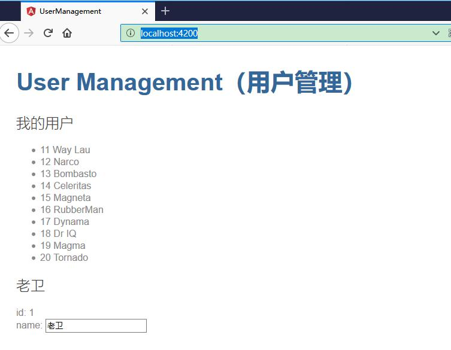
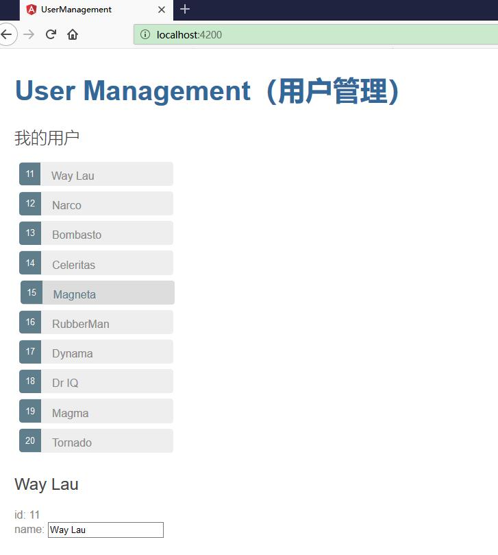
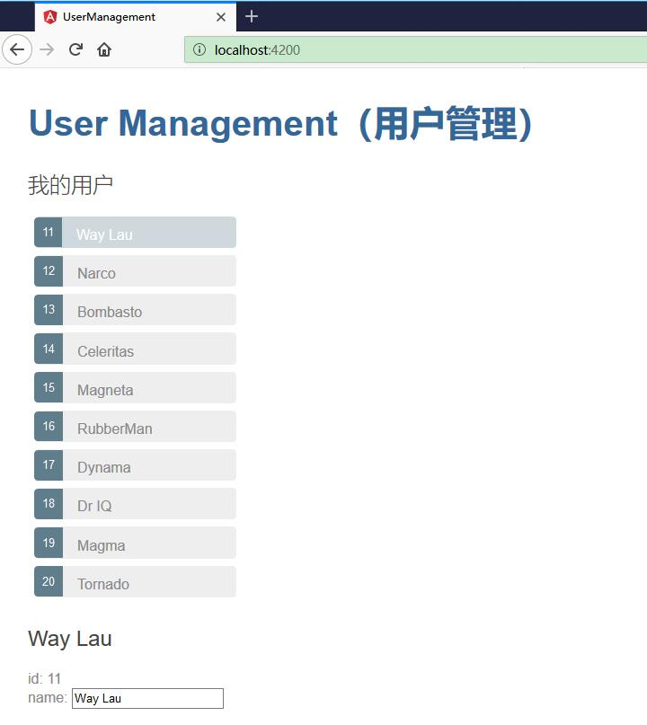

# 展示用户列表

本节，我们将展示用户列表。当选中某个用户时，能够查看到该用户的详细信息。


## 创建模拟（mock）的用户数据


由于目前，我们的应用都是纯粹的客户端程序，并非涉及数据的存储以及接口的访问，所以，我们只能模拟（mock）一些用户列表数据。


在 src/app/ 文件夹中创建一个名叫 mock-users.ts 的文件。 定义一个包含十个用户的常量数组 USERS，并导出它。 该文件是这样的。

```ts
import { User } from './user';

export const USERS: User[] = [
  { id: 11, name: 'Way Lau' },
  { id: 12, name: 'Narco' },
  { id: 13, name: 'Bombasto' },
  { id: 14, name: 'Celeritas' },
  { id: 15, name: 'Magneta' },
  { id: 16, name: 'RubberMan' },
  { id: 17, name: 'Dynama' },
  { id: 18, name: 'Dr IQ' },
  { id: 19, name: 'Magma' },
  { id: 20, name: 'Tornado' }
];
```


## 展示用户列表

我们将要在 UsersComponent 的顶部显示这个用户列表。

打开 UsersComponent 类文件 src/app/users/users.component.ts ，并导入模拟的 USERS

```ts
import { USERS } from '../mock-users';
```

往类中添加一个 users 属性，这样可以暴露出这些用户，以供后续绑定。

```ts
users = USERS;
```


## 使用 *ngFor 列出这些用户

*ngFor 是一个 Angular 的复写器（repeater）指令。 它会为列表中的每项数据复写它的宿主元素。类似于 Java  或者 JavaScript 中的 for-each 循环。

用法如下：

```html
<li *ngFor="let user of users">
```

在这个例子中,

* `<li>` 就是 *ngFor 的宿主元素
* users 就是来自 UsersComponent 类的列表。
* 当依次遍历这个列表时，user 会为每个迭代保存当前的用户象。


效果如下：




完整代码如下：

```html
<h2>我的用户</h2>
<ul class="users">
  <li *ngFor="let user of users">
    <span class="badge">{{user.id}}</span> {{user.name}}
  </li>
</ul>
```


## 增加样式

目前，展示用户数据是没有问题了。只是不大美化，此时需要CSS来帮忙。

编辑 users.component.css ，添加如下样式：

```css
/* UsersComponent's private CSS styles */
.selected {
  background-color: #CFD8DC !important;
  color: white;
}
.users {
  margin: 0 0 2em 0;
  list-style-type: none;
  padding: 0;
  width: 15em;
}
.users li {
  cursor: pointer;
  position: relative;
  left: 0;
  background-color: #EEE;
  margin: .5em;
  padding: .3em 0;
  height: 1.6em;
  border-radius: 4px;
}
.users li.selected:hover {
  background-color: #BBD8DC !important;
  color: white;
}
.users li:hover {
  color: #607D8B;
  background-color: #DDD;
  left: .1em;
}
.users .text {
  position: relative;
  top: -3px;
}
.users .badge {
  display: inline-block;
  font-size: small;
  color: white;
  padding: 0.8em 0.7em 0 0.7em;
  background-color: #607D8B;
  line-height: 1em;
  position: relative;
  left: -1px;
  top: -4px;
  height: 1.8em;
  margin-right: .8em;
  border-radius: 4px 0 0 4px;
}
```


这些样式，只为 UsersComponent 组件所使用。


效果如下：


## 添加事件

点击用户列表中的某个用户时，该组件应该在页面底部显示所选用户的详情。


添加 click 事件绑定的方式如下：

```html
<li *ngFor="let user of users" (click)="onSelect(user)">
```

click 外面的圆括号会让 Angular 监听这个 <li> 元素的 click 事件。 当用户点击 <li> 时，Angular 就会执行表达式 onSelect(user)。

onSelect() 是 UsersComponent 上的一个方法，接下来就会实现它。 Angular 会把所点击的 <li> 上的 user 对象传给它，这个 user 也就是前面在 *ngFor 表达式中定义的那个。


修改 src/app/users/users.component.ts 把该组件的 user 属性改名为 selectedUser ，但不要为它赋值。 因为应用刚刚启动时并没有所选用户。

添加如下 onSelect() 方法，它会把模板中被点击的用户赋值给组件的 selectedUser 属性。

```ts
selectedUser: User;

onSelect(user: User): void {
  this.selectedUser = user;
}
```


同时修改 users.component.html，把 user 更名为 selectedUser：

```html
<h2>{{selectedUser.name}}</h2>
<div><span>id: </span>{{selectedUser.id}}</div>
<div>
<label>name:
    <input [(ngModel)]="selectedUser.name" placeholder="name">
</label>
</div>
```


此时如果刷新浏览器，会报如下错误：

```ts
ERROR TypeError: "_co.selectedUser is undefined"
```

错误原因是，模版中 selectedUser 的并未初始化，所以，selectedUser.name中的属性是空的。

所以，我们要加多一个判断，该组件应该只有当 selectedUser 存在时才显示所选用户的详情。

把显示用户详情的 HTML 包裹在一个 <div> 中。 并且为这个 div 添加 Angular 的 *ngIf 指令，把它的值设置为 selectedUser 即可。


```html
<div *ngIf="selectedUser">
  <h2>{{selectedUser.name}}</h2>
  <div><span>id: </span>{{selectedUser.id}}</div>
  <div>
  <label>name:
      <input [(ngModel)]="selectedUser.name" placeholder="name">
  </label>
  </div>
</div>
```


当 selectedUser 为 undefined 时，ngIf 从 DOM 中移除了用户详情。当选中一个用户时，selectedUser 也就有了值，并且 ngIf 把用户的详情放回到 DOM 中。

效果如下：



## 选中的样式

目前，很难识别哪些用户是已经选中的。我们需要在选中的用户上添加选中的样式`.selected`。

这个样式已经在 users.component.css 定义了，所以只要实施他即可。我们需要做下判断，如果当前用户是选中的用户，该用户就添加 `.selected` 样式，负责就移除`.selected` 样式。

那么如何实现判断呢？


Angular 的 CSS 类绑定机制让根据条件添加或移除一个 CSS 类变得很容易。 只要把 [class.some-css-class]="some-condition" 添加到你要施加样式的元素上就可以了。

用法如下：

```html
[class.selected]="user === selectedUser"
```

如果当前行的用户和 selectedUser 相同，Angular 就会添加 CSS 类 selected，否则就会移除它。

完整代码如下：

```html
<h2>我的用户</h2>
<ul class="users">
    <li *ngFor="let user of users" 
    [class.selected]="user === selectedUser"
    (click)="onSelect(user)">
    <span class="badge">{{user.id}}</span> {{user.name}}
  </li>
</ul>
```


效果如下：

