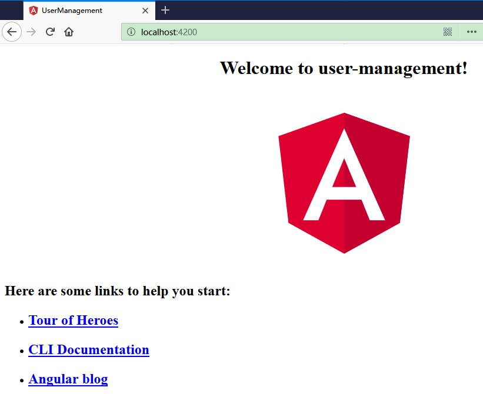

# 用户管理

快速实现一个用户管理系统。

## 新建 user-management 应用

使用 Angular CLI 命令行工具创建一个名为“user-management”的应用。

```ts
ng new user-management
```

执行以下命令，来启动应用。

```ts
cd user-management
ng serve --open
```


此时，应用就会自动在浏览器中打开。访问地址为 <http://localhost:4200/>。



## Angular 组件

组件是 Angular 应用中的基本构造块。它们在屏幕上显示数据，监听用户输入，并且根据这些输入执行相应的动作。

上面你所看到的这个页面就是应用的外壳。这个外壳是被一个名叫 AppComponent 的 Angular 组件控制的。

AppComponent 主要由三个实现文件：

* app.component.ts— 组件的类代码，这是用 TypeScript 写的。
* app.component.html— 组件的模板，这是用 HTML 写的。
* app.component.css— 组件的私有 CSS 样式。

